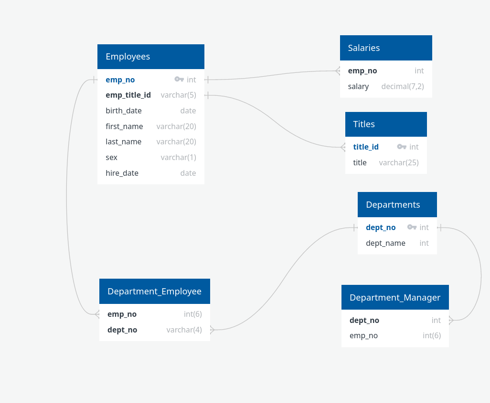

# Background

As a newly hired data engineer at Pewlett Hackard, your primary objective is to investigate the employment records of individuals hired during the 1980s and 1990s. With only six CSV files remaining from that period, your responsibilities include constructing SQL tables to store the CSV data, importing the CSV files into the SQL database, and conducting comprehensive data analysis. This entails designing the SQL queries for importing the CSV data and performing thorough analysis to extract meaningful insights.

## Objectives

### Data Modeling

The first step in this project involves downloading the provided CSV files containing data from Pewlett Hackard. With these files in hand, your task is to design an appropriate database schema by modeling tables that accurately represent the data within the CSV files.

[Download Starter Code Zip](https://static.bc-edx.com/data/dl-1-1/m9/lms/starter/m9-starter-code.zip)

ERD Image




### Data Engineering

Utilize the provided data to devise a table schema for each of the six CSV files.

```sql
CREATE TABLE titles (
    title_id VARCHAR(5) NOT NULL,
    title VARCHAR(25) NOT NULL,
    PRIMARY KEY (title_id)
);

CREATE TABLE employees (
    emp_no INT NOT NULL,
    emp_title_id VARCHAR(5) NOT NULL,
    birth_date DATE NOT NULL,
    first_name VARCHAR(20) NOT NULL,
    last_name VARCHAR(20) NOT NULL,
    sex VARCHAR(1) NOT NULL,
    hire_date DATE NOT NULL,
    PRIMARY KEY (emp_no),
    FOREIGN KEY (emp_title_id) REFERENCES titles (title_id)
);

CREATE TABLE salaries (
    emp_no INT NOT NULL,
    salary DECIMAL(7,2) NOT NULL,
    PRIMARY KEY (emp_no),
    FOREIGN KEY (emp_no) REFERENCES employees (emp_no)
);

CREATE TABLE departments (
    dept_no INT NOT NULL,
    dept_name VARCHAR(255) NOT NULL,
    PRIMARY KEY (dept_no)
);

CREATE TABLE dept_manager (
    dept_no INT NOT NULL,
    emp_no INT NOT NULL,
    PRIMARY KEY (dept_no, emp_no),
    FOREIGN KEY (dept_no) REFERENCES departments (dept_no),
    FOREIGN KEY (emp_no) REFERENCES employees (emp_no)
);

CREATE TABLE dept_emp (
    emp_no INT NOT NULL,
    dept_no INT NOT NULL,
    PRIMARY KEY (emp_no, dept_no),
    FOREIGN KEY (emp_no) REFERENCES employees (emp_no),
    FOREIGN KEY (dept_no) REFERENCES departments (dept_no)
);
```

### Data Analysis

```sql
-- Data Analysis

-- Question 1. List the employee number, last name, first name, sex, and salary of each employee.

SELECT employee.emp_no
	,employee.last_name
	,employee.first_name
	,employee.sex
	,salary.salary
FROM employees AS employee
INNER JOIN salaries AS salary ON salary.emp_no = employee.emp_no;

-- Question 2. List the first name, last name, and hire date for the employees who were hired in 1986.

SELECT 
    first_name, 
    last_name,
    hire_date
FROM employees 
WHERE hire_date >= '1986-01-01' AND hire_date <= '1986-12-31'

-- Question 3. List the manager of each department along with their department number, department name, employee number, last name, and first name.

SELECT departments.dept_no,
       departments.dept_name,
       dept_manager.emp_no,
       employees.last_name,
       employees.first_name
FROM departments departments
    INNER JOIN department_manager dept_manager
        ON departments.dept_no = dept_manager.dept_no
    INNER JOIN employees employee
        ON dept_manager.emp_no = employee.emp_no;

-- Question 4. List the department number for each employee along with that employee’s employee number, last name, first name, and department name.

SELECT dept_emp.emp_no,
       employees.last_name,
       employees.first_name,
       departments.dept_name
FROM department_Employee dept_emp
    INNER JOIN employee
        ON dept_emp.emp_no = employee.emp_no
    INNER JOIN departments
        ON dept_emp.dept_no = departments.dept_no;

-- Question 5. List first name, last name, and sex of each employee whose first name is Hercules and whose last name begins with the letter B.

SELECT 
    first_name, 
    last_name, 
    sex
FROM employees
WHERE first_name = 'Hercules' AND last_name LIKE 'B%';


-- Question 6. List each employee in the Sales department, including their employee number, last name, and first name.

SELECT employee.emp_no,
       employee.last_name,
       employee.first_name
FROM department_Employee dept_emp
    INNER JOIN employees employee
        ON dept_emp.emp_no = employee.emp_no
    INNER JOIN departments departments
        ON dept_emp.dept_no = departments.dept_no
WHERE departments.dept_name = 'Sales';


-- Question 7. List each employee in the Sales and Development departments, including their employee number, last name, first name, and department name.

SELECT employee.emp_no,
       employee.last_name,
       employee.first_name,
       departments.dept_name
FROM department_Employee dept_emp
    INNER JOIN employees employee
        ON dept_emp.emp_no = employee.emp_no
    INNER JOIN departments departments
        ON dept_emp.dept_no = departments.dept_no
WHERE departments.dept_name IN ( 'Sales', 'Development' );

-- Question 8. List the frequency counts, in descending order, of all the employee last names (that is, how many employees share each last name).

SELECT last_name,
       COUNT(last_name) AS "last_name_count"
FROM employees
GROUP BY last_name
ORDER BY COUNT(last_name) DESC;
```
